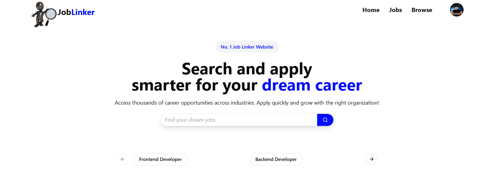
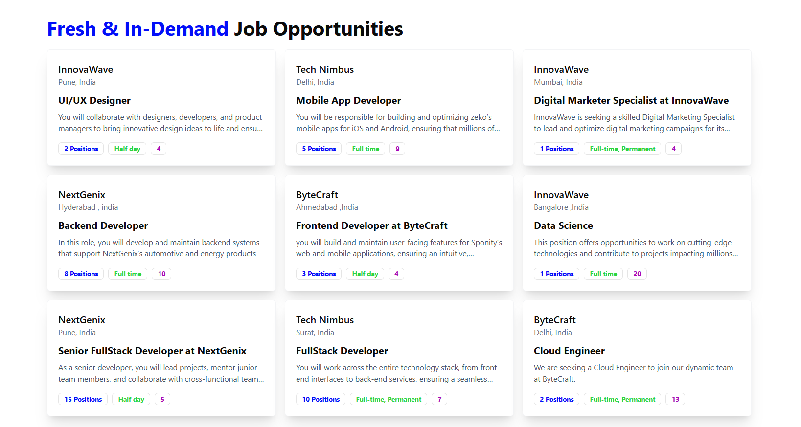

 <h1 align="center">JobLinker - Find Your Dream Job</h1>

 

<h2> Authentication (Sign-in / Sign-up)</h2>

-  SignIn and signup functionality.
- Two types of users: Students and Recruiters.

 

<h2> Recruiter Panel </h2>

- **Register Company**: Recruiter first registers their company details.

- **Create Jobs**: After company registration, recruiters can post new job openings.

- **View Applicants**: Recruiters can:

     - See which students applied for which jobs.

     - View students resumes .

- Accept or Reject students based on their applications.

- **Manage Applications**: Recruiters can track all applications for their jobs.

 

<h2> Student Panel </h2>

- **Browse Jobs**: Students can view all jobs posted by recruiters.

- **Apply for Jobs**: Students can apply for jobs matching their skills.

- **Application Status**: Students can:

  -  Track the status of their applications (Selected, Rejected, or Pending).

  - See all jobs they have applied to.

 - **Search and Filter Jobs**:

    - **Search by Keywords**: Students can search jobs using job title, or specific Skills.

    -  **Filter by Skill**: Students can filter jobs based on required skills.

    -  **Filter by Location**: Students can also filter jobs based on location (e.g., Delhi, Mumbai, Bangalore).

   

<h2> Extra Details</h2>

- Clean UI flow between registration, job creation, job application, and status updates.

- Authentication ensures that Recruiters and Students stay in their respective dashboards.

 

<h2> Tech Stack</h2>

- **Frontend**: Built with React.js for a responsive and dynamic UI.

- **Styling**: Utilizes TailwindCSS for a modern, mobile-friendly design.

- **State Management**: Managed with Redux Toolkit for efficient data handling.

- **Backend**: Powered by Node.js and Express.js for API handling and server-side logic.

- **Database**: MongoDB for flexible, schema-less data storage.

- **Authentication**: Secure login with JWT (JSON Web Tokens) for user sessions.

- **File Storage**: Integrated Cloudinary for storing resumes and media files.

 

<h2>Website Preview</h2>

 

